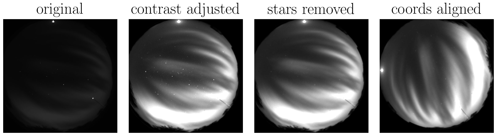

# All-Sky Images Processing

This repository contains scripts and tools for processing images obtained from an all-sky imager. The processing pipeline includes various filters such as contrast and brightness adjustments, image linearization, and coordinate adjustments.

## Overview

The all-sky imager captures wide-angle images of the sky, which require several preprocessing steps before analysis or visualization. This repository provides scripts and tools to facilitate the following image processing tasks:

- Contrast and Brightness Adjustment: Enhance the visibility of features by adjusting contrast and brightness parameters.
- Image Linearization: Correct distortions or non-linearities in the captured images.
- Coordinate Adjustment: Align images based on celestial coordinates or correct for specific alignments.

## Features

- Contrast and Brightness Filters: Apply customizable filters to adjust image contrast and brightness according to specific requirements.
- Image Linearization Tools: Correct image distortions and nonlinearities caused by the imaging setup.
- Coordinate Adjustment Utilities: Align images based on celestial coordinates or custom alignment requirements.

